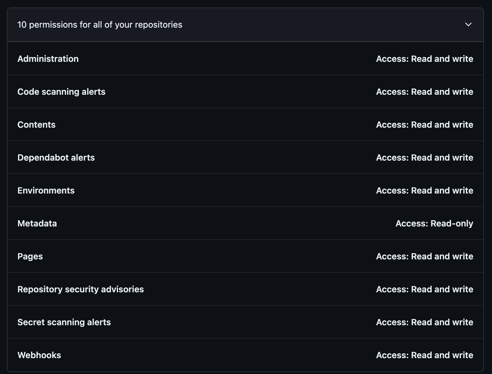
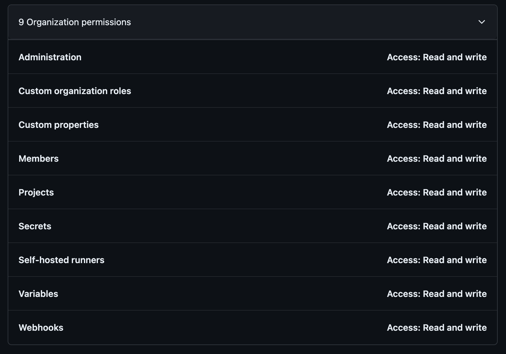

# conf42-2024-devops-agile-efficiency-git
Unlocking Agile Efficiency: DevOps Speedup with GIT

# Prereq
- Create a new Free Organization
  - Name: conf42-2024-devops-jhonnypong
  - Belongs to: Personal
  - Skip add members
- Create a personal access token
- Export your Personal Access Token on your terminal like 
  - Repositories Permissions
  
  - Organization Permissions
  

Prepare your environment
```bash
export GITHUB_TOKEN=github_pat_YOUR_ACCESS_TOKEN
export GITHUB_ORGANIZATION=conf42-2024-devops
#You need exported this if you have your onprem or cloud Github installation
#export GITHUB_BASE_URL=https://github.com/api/v3/
```
Validate if your export works fine
```bash
## List All public organizations
curl -L \
  -H "Accept: application/vnd.github+json" \
  -H "Authorization: Bearer $GITHUB_TOKEN" \
  -H "X-GitHub-Api-Version: 2022-11-28" \
  https://api.github.com/organizations

## List your Organizations
curl -L \
  -H "Accept: application/vnd.github+json" \
  -H "Authorization: Bearer $GITHUB_TOKEN" \
  -H "X-GitHub-Api-Version: 2022-11-28" \
  https://api.github.com/user/orgs

curl -L \
  -H "Accept: application/vnd.github+json" \
  -H "Authorization: Bearer $GITHUB_TOKEN" \
  -H "X-GitHub-Api-Version: 2022-11-28" \
  https://api.github.com/orgs/$GITHUB_ORGANIZATION

## List your repositories
curl -L \
  -H "Accept: application/vnd.github+json" \
  -H "Authorization: Bearer $GITHUB_TOKEN" \
  -H "X-GitHub-Api-Version: 2022-11-28" \
  https://api.github.com/user/repos
```
> If previous checks with curl fail, you need take a look for previous section! You CAN'T continue at this point!


# General references
https://docs.github.com/en/enterprise-server@3.9/authentication/keeping-your-account-and-data-secure/managing-your-personal-access-tokens